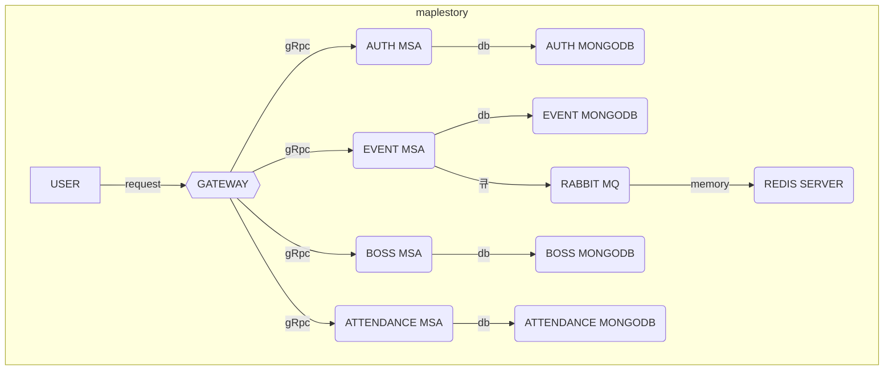

# MapleStory Event Project

| 구분       | 설명                               |
| ---------- | ---------------------------------- |
| **과제명** | **이벤트 / 보상 관리 플랫폼 구축** |
| **포지션** | **웹 백엔드 엔지니어**             |
| **이름**   | **박상량**                         |

---

### 📦 시작하기

> **api** : [http://localhost:3000](http://localhost:3000)

> **swagger** : [http://localhost:3000/api-docs](http://localhost:3000/api-docs)

```bash
## sh
> docker compose up --build
```

---

### 🛠 기술 스택

| 컴포넌트            | 기술 스택      |
| ------------------- | -------------- |
| **node**            | NodeJS 18      |
| **Infra**           | Docker Compose |
| **DB**              | mongodb, redis |
| **Network**         | GRPC           |
| **Architecture**    | Nestjs MSA     |
| **MessageFlatform** | RabbitMQ       |

---

### 요구사항 구현 설명

### 🌟 권한관리

관리자가 모든 사용자의 권한 변경이 가능합니다.
**_JWT를 사용하므로 권한을 변경해도 기존 발급된 토큰을 사용할 수 있는 문제점이 있습니다._**
**TokenVersion**을 저장하고 권한이 변경되면 해당 사용자의 version을 업데이트하여
기존 토큰과 비교 후 **사용 여부를 판단**할 수 있는 로직을 추가했습니다.

### 🌟 보상요청 중복 방지 (동시성 처리)

유저의 악의적인 요청으로 **중복된 보상요청**이 발생할 수 있습니다.
**다중 인스턴스** 환경을 고려하여`Redis`의 **분산락**과 `RabbitMQ`를 이용하여 *WokerModule*을 구성했습니다.
**k6로 부하 테스트를 진행하였습니다. (vus:1000 / duration:5초)**

> ./k6/event_result.json에 결과 파일을 저장했습니다.

### 🌟 grpc

사용자 요청은 gateway 서버를 REST 요청을 하게 되며,
**MSA 간 통신은 gRPC를 사용**했습니다.
*protoc-gen-ts_proto*로 Typescript로 컴파일 후 공통 인터페이스를 구현했습니다.

> ./libs/repo/src/grpc

> ./proto

### 🌟 dto

`proto`에서 변환된 각 MicroService.ts를 공통 인터페이스로 사용하여, 서비스간 타입을 유지하였습니다.

### 🌟 libs

각 서비스간 **공통 라이브러리, 인터페이스를 위한 공통 레포지토리**

### 🌟 authGuard

커스텀 및 확장성을 고려하여 **CanActivate**를 이용, 함수 하단 필요한 로직 구현했습니다.

```js
@Injectable()
export class AuthGuard implements CanActivate {
    constructor(
        private readonly authService: GatewayAuthService,
        private readonly reflector: Reflector,
    ) {}
    ...
}

// decorator
export const Auth = Reflector.createDecorator<{
    isRefresh: boolean;
}>();

// controller
@Auth()
get(){}
```

### 🌟 rolesGuard

```js
// auth guard를 통과하고 파싱된 토큰에서 role을 추출
async canActivate(context: ExecutionContext): Promise<boolean> {
    const roles = this.reflector.get<AuthMicroService.UserRole[]>(Roles, context.getHandler());
    if (roles === undefined || roles.length === 0) return true;

    const request = context.switchToHttp().getRequest<Request>();
    const user = request.user;
    if (!user) return false;

    const userRole = user.role;
    if (roles.includes(userRole)) {
        return true;
    }

    throw new ForbiddenException('권한이 없습니다.');
}

// controller
@Roles([AuthMicroService.UserRole.ADMIN])
get(){}
```

---

### 💻 서버구성



### database

| 스키마       | 설명                                     |
| ------------ | ---------------------------------------- |
| USER         | 사용자정보(이메일, 권한, 비밀번호)       |
| EVENT        | 이벤트 상세 정보(이벤트명, 이벤트 종류)  |
| EVENT_REWARD | 이벤트 보상 정보                         |
| ATTENDANCE   | 이벤트 검증을 위한 출석 로깅             |
| REDIS        | 분산락 활용을 위한 인메모리 데이터베이스 |
| RABBITMQ     | 동시성 처리(이벤트 참여)를 위한 큐       |

- `BOSS`, `ATTENDANCE`: 실무의 관점에서 보스관리나, 출결관리는 따로 서버를 구성하는게 이점이 있을거라 판단하여 추가했습니다.

---

### 📚 Features

`요구사항의 핵심이 되는 api만 작성하였습니다.`
`자세한 문서는` [http://localhost:3000/api-docs](http://localhost:3000/api-docs) `에서 확인 가능합니다.`

- 인증
    - [사용자등록](#사용자등록)
    - [권한변경](#권한변경)
- 이벤트
    - [이벤트등록](#이벤트등록)
    - [보상생성](#보상생성)
    - [보상요청 / 이벤트참여](#보상요청)
    - [보상결과조회](#보상결과조회)

#### 사용자등록

- **_POST_** `/auth/signup`
- **ROLES** : 전체
- `role`은 `ADMIN`, `OPERATOR`, `AUDITOR`, `USER`만 입력가능

- 요청 예시
    ```javascript
    {
        "email": "admin@nexon.com",
        "role": "ADMIN",
        "password": "pass1234"
    }
    ```
- 응답 예시
    ```javascript
    HTTP 201
    {
        "email": "admin@nexon.com",
        "role": "ADMIN"
    }
    ```
- | 응답오류 | 설명                        |
  | -------- | --------------------------- |
  | 400      | 권한값이 유효하지 않은 경우 |
  | 409      | 존재하는 이메일인 경우      |

#### 권한변경

- **_PATCH_** `/auth`
- **ROLES** : `ADMIN`
- **권한을 변경하면 저장된 TokenVersion을 증가시켜 기존 토큰을 강제로 사용불가 처리**
- `role`은 `ADMIN`, `OPERATOR`, `AUDITOR`, `USER`만 입력가능

- 요청 예시
    ```javascript
    {
        "email": "operator@nexon.com",
        "role": "OPERATOR"
    }
    ```
- | 응답오류 | 설명                        |
  | -------- | --------------------------- |
  | 400      | 권한값이 유효하지 않은 경우 |
  | 403      | 변경 권한이 없는 경우       |
  | 404      | 존재하지않는 이메일인 경우  |

#### 이벤트등록

- **_POST_** `/event`
- **ROLES** : `ADMIN`, `OPERATOR`
- `eventCondition`의 타입은 `CLEAR_BOSS`, `ATTENDANCE`

    - `CLEAR_BOSS`의 경우 `bossid` 필요
        - `bossid`의 경우 `SWOO`, `DEMIAN`
    - `ATTENDANCE`의 경우 `days` 필요

- 요청 예시
    ```javascript
    {
        "title": "기간 내 스우 클리어",
        "eventCondition": {
            "type": "CLEAR_BOSS", // 'CLEAR_BOSS', 'ATTENDANCE'
            "payload": {
                "bossid": "SWOO" //'SWOO', 'DEMIAN'
                // days : 3
            }
        },
        "startDate": "2025-05-01",
        "endDate": "2025-06-30",
        "isActive": true
    }
    ```
- | 응답오류 | 설명                                     |
  | -------- | ---------------------------------------- |
  | 400      | eventCondition의 값이 유효하지 않은 경우 |
  | 400      | 이벤트 일자 형식이 올바르지 않은 경우    |
  | 403      | 등록 권한이 없는 경우                    |

#### 보상생성

- **_POST_** `/event/:eventId/reward`
- **ROLES** : `ADMIN`, `OPERATOR`
- 이벤트 생성 후 해당 이벤트에 등록할 보상 생성
- 하나의 이벤트에 같은 타입의 보상은 중복으로 생성 불가
- `type`은 `MAPLE_POINT`, `MAPLE_COIN`

- 요청 예시
    ```javascript
    {
        "type": "MAPLE_POINT",
        "amount": 1000
    }
    ```
- | 응답오류 | 설명                                                     |
  | -------- | -------------------------------------------------------- |
  | 400      | type의 값이 유효하지 않은 경우 (MAPLE_COIN, MAPLE_POINT) |
  | 409      | 같은 type의 보상을 중복으로 등록하는 경우                |

#### 보상요청

- **_POST_** `/event/:eventId/participate`
- **ROLES** : `USER`
- 검증

    - 이벤트 보상 수령 유무 검증
    - 이벤트 기간 검증
    - 이벤트 활성화 검증
    - 이벤트 조건 달성 검증

- 요청 예시
    ```javascript
    {
        "rewardType": "MAPLE_POINT"
    }
    ```
- 응답 예시
    ```javascript
    HTTP 201
    {
        "status": "SUCCESS", // 'SUCCESS', 'REJECTED'
        "message": "보상 수령 완료" // 보상이 등록되지 않은 이벤트 입니다. 관리자에게 문의해주세요.
    }
    ```

#### 보상결과조회

- **_GET_** `/event/participate`
- **ROLES** : `ADMIN`, `OPERATOR`, `AUDITOR`
- **필터링** (query string)
    - eventId (optional) : string
    - status (optional) : `SUCCESS`, `REJECTED`
    - userId (optional) : string
- 필터링 된 모든 결과가 리스트로 출력됩니다.
- 응답 예시
    ```javascript
    HTTP 201
    {
        "eventParticipates": [
            {
            "userId": "60a9b734b5d2b444c5d2b444",
            "status": "REJECTED",
            "rejectedReason": "보상 수령 이력이 존재합니다.",
            "createdAt": "yyyy-MM-dd HH:mm:ss",
            "event": {
                "id": "123",
                "title": "스우 클리어",
                "eventCondition": {
                    "type": "CLEAR_BOSS",
                    "payload": {
                        "bossid": "SWOO"
                    }
                },
                "startDate": "2025-05-01",
                "endDate": "2025-06-30",
                "isActive": true
            }
            }
        ]
    }
    ```
